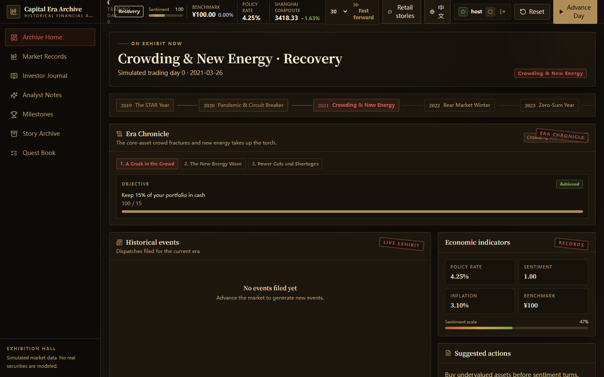
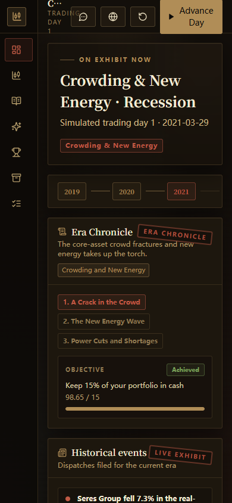
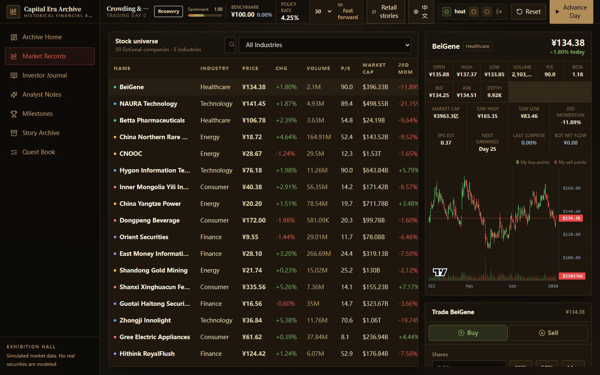
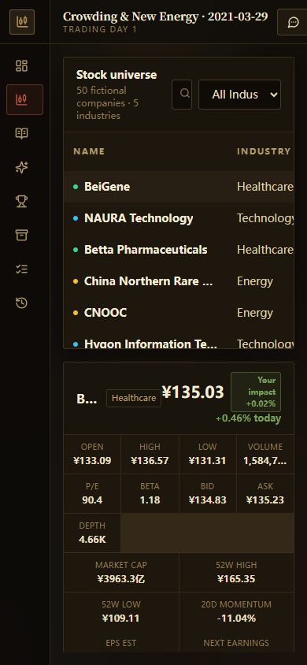
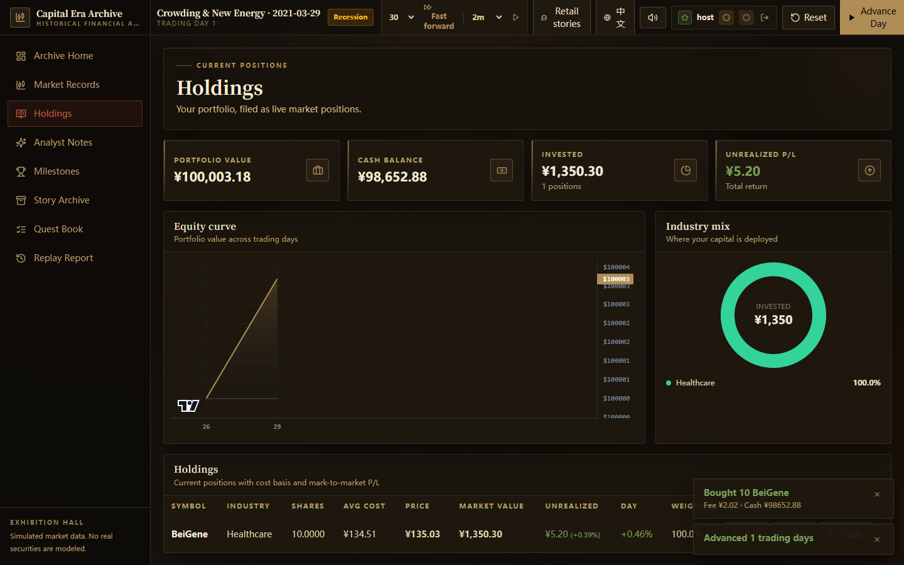
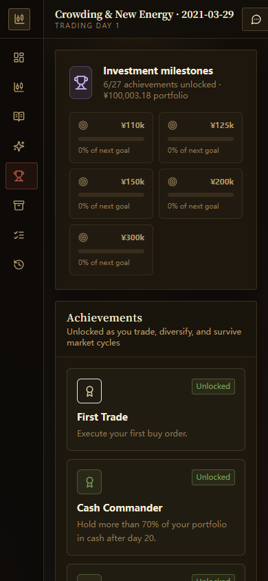
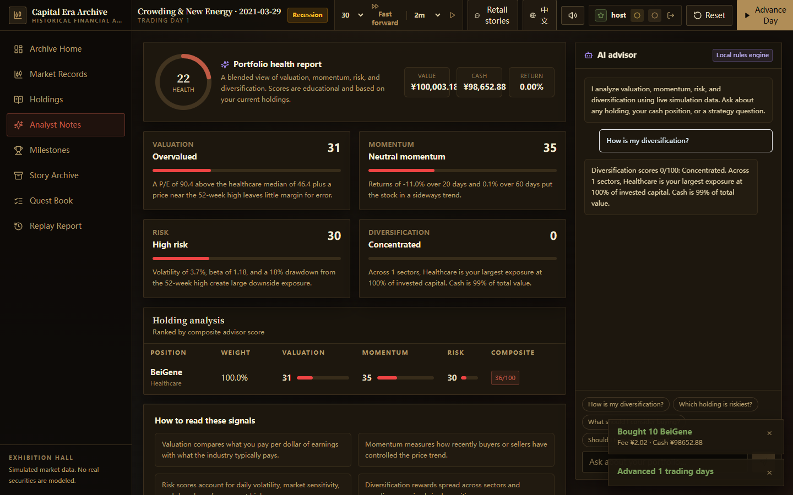
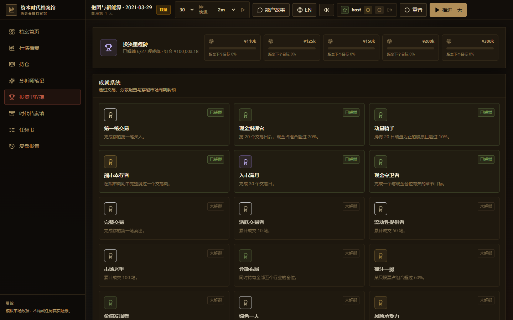

# Capital Market Simulator

[](https://github.com/JawLinker/capital-market-sim/actions/workflows/ci.yml)
[](LICENSE)

A historical financial archive: a stock market simulation presented as a
digital museum of financial eras. Start with ¥100,000 in virtual
cash, trade 50 real A-share companies across five industries, and try to beat
the Shanghai Composite through bull, bear, recovery, and recession cycles.
Every price move is real history, replayed day by day.



## Highlights

- **Real market replay**: 50 A-share companies plus the Shanghai Composite,
  covering 2019-2026. The first 504 trading days seed chart history; each
  `Advance Day` replays the next real daily OHLC row, so future moves are
  genuine A-share history rather than synthetic noise
- **Museum experience**: archival dark-room design with a playable era
  timeline, historical event clippings, an investor journal, and a dossier
  story archive
- **Era chronicles**: the replay is scripted into six story arcs from 2021 to
  2026, with chapter events and portfolio objectives, including the 2026
  tech-wave arc
- **Golden age transitions**: every new calendar year opens with a Civ-style
  era banner graded by your total return
- **Legend NPC traders**: anonymized market archetypes such as the Ningbo
  commandos and the noodle man trade live against you in the leaderboard
- **Procedural avatars**: every player and legend NPC gets a deterministic
  icon-and-color avatar, generated locally with no image assets
- **Quest book**: every chronicle chapter is a formal task with a reward,
  tracked in a dedicated quest page that shows the full era task tree
- **Daily challenges & NPC commissions**: a date-seeded objective rotates
  daily, and legend NPCs send personalized commissions tied to the market cycle
- **Black swan events**: advancing day by day can trigger era-flavored market
  shocks with cinematic popups that shift market sentiment
- **Season medals, NPC storylines, and replay**: weekly leaderboard seasons
  award medals, four legend NPCs run five-lesson storyline quests, and a
  replay report grades every trading decision
- **Persistent career**: achievements, titles, and rank streaks survive market
  resets, so your account keeps growing between runs
- **Deeper trading**: limit orders, stop-loss, and take-profit orders fill as
  the market moves, and a duel table lets you bet your cash against NPC rivals
- **Sound design**: synthesized buy, sell, advance, achievement, black swan,
  and duel sounds with a mute toggle, no audio assets required
- **Game-feel controls**: Space advances the day, B/P/Q/R jump between pages,
  M toggles sound, one-click 1-lot orders, and stat values tick when they
  change
- **Player decisions**: black swans and era transitions now ask you to choose,
  with cash and sentiment consequences, and coin sounds celebrate profitable
  moments
- **Judgment validation**: tag each buy with a thesis; the market later rules
  it right or wrong with a golden toast or a face-slap, building a seer streak
- **Auto play**: a countdown-driven live market mode where each trading day
  lasts 0.5-2 minutes (default 2), one week takes about 10 minutes, intraday
  prices tick live, and events pause the action
- **Player price impact**: your buy and sell orders push prices, shown as a
  live impact badge, and the effect decays over the following trading days
- **Newspaper earnings & policy wires**: giant-company earnings open as a
  Capital Daily front page, and policy/international shocks join the black swan
  pool from 2021 to 2026
- **Dividends & market review**: companies pay annual cash dividends that
  adjust prices on the ex-date, the newspaper gains a market-review page with
  northbound flows, and the dashboard shows the daily northbound indicator
- **A-share rules**: 10%/20% daily price limits, T+1 settlement, commissions,
  minimum fees, and 0.05% sell-side stamp duty
- **Order-book microstructure**: every stock has live bid/ask depth; large
  market orders walk the price and cause slippage; thin liquidity can trigger
  bot panic selling
- **Realistic ecosystem**: 8 institutional strategies and 28 behavior-driven
  retail bots trade daily with real holdings; their order flow moves prices and
  their returns span large losses to large gains
- **Retail investor stories**: an era-flavored fictional tale pops up after
  every fifth trading day, written like a market archive from 1993 to 2024,
  with 20+ bilingual dossiers, a browsable "Retail Era Archive" page, and a
  "tell me another" mode
- **Legend dossiers & timeline**: anonymized legends inspired by real market
  folklore (limit-up commandos, lights-off noodles, sack-of-cash lithium)
  plus a factual historical timeline from 1988 to 2019
- **Full product surface**: dashboard, market terminal, portfolio analytics,
  rule-based AI advisor, achievements, manager archives, leaderboard, and
  English/Chinese UI
- **LAN multiplayer**: friends on the same network can register accounts, trade
  the same shared market replay, and compare leaderboard returns

## Screenshots

| Desktop | Mobile |
| --- | --- |
|  |  |
|  |  |
|  |  |
|  |  |

## Tech Stack

| Layer | Technology |
| --- | --- |
| Frontend | React 18, Vite, Tailwind CSS, lightweight-charts, lucide-react |
| Backend | Python FastAPI, SQLAlchemy 2 |
| Database | SQLite, zero-config, per-player save files |
| Tests | pytest backend suite, Playwright E2E visual verification |
| Packaging | PyInstaller single-file Windows executable |

## Quick Start

Requirements: Python 3.12+ and Node.js 18+.

### One-click start (recommended)

On Windows, double-click `start.bat` (or run `.\start.ps1`). The script creates
the backend environment, builds the frontend when needed, starts the game, and
opens the browser at http://127.0.0.1:8000. Close the window to stop.

### Manual start

Backend (terminal 1):

```bash
cd backend
python -m venv .venv
.venv\Scripts\activate        # Windows
pip install -r requirements.txt
uvicorn app.main:app --reload --port 8000
```

Frontend (terminal 2):

```bash
cd frontend
npm install
npm run dev
```

Open http://127.0.0.1:5173 and log in with the seeded account `host / 123456`.
The SQLite database is created and seeded automatically at
`backend/data/market.db` on first startup. Use the globe button in the top bar
to switch between English and Chinese. The UI defaults to Chinese.

## Run the Tests

Backend:

```bash
cd backend
pytest -q
```

Frontend build check:

```bash
cd frontend
npm run build
```

End-to-end visual pass (requires both servers above and Playwright):

```bash
npm install              # repo root, installs Playwright
npx playwright install chromium
npm run test:e2e
```

The E2E script walks every page, places a trade, advances the market, verifies
canvas rendering, and saves desktop and mobile screenshots to `screenshots/`.

## Package as a Desktop App

`package.ps1` builds the game into a standalone Windows executable with no Node
or Python dependency:

```powershell
.\package.ps1
```

Output goes to `release/`:

- `CapitalMarketSim.exe` - double-click to play; opens http://127.0.0.1:8000
- `CapitalMarketSim.zip` - shareable build for friends

Each player keeps their own save at `data/market.db` next to the executable.

## LAN Multiplayer

1. One machine starts the game (dev servers or the packaged exe). The console
   prints the local URL and the LAN URL, e.g. `http://192.168.1.5:8000`.
2. Friends on the same Wi-Fi/LAN open the LAN URL and register an account.
   Everyone gets ¥100,000, their own portfolio, and a leaderboard entry while
   sharing one market replay and news feed.
3. The first registered player is the host and can advance time, fast-forward,
   or reset the market. The seeded host account is `host / 123456`.

## Deploy Online

The backend serves the built React app on one port, so the whole game runs as a
single container.

Docker locally:

```bash
docker compose up --build
```

Open http://127.0.0.1:8000. The compose demo host password defaults to
`host123456`; set `CMS_HOST_PASSWORD` to change it.

One-click cloud options (the `Dockerfile` is already in the repo):

- Zeabur: connect the GitHub repo and let it auto-detect the Dockerfile
- Render: create a Blueprint from `render.yaml`, or add a Web Service with the
  Docker runtime
- Alibaba Cloud: follow [docs/DEPLOY-ALIYUN.md](docs/DEPLOY-ALIYUN.md) and run
  `deploy/setup-aliyun.sh` on a lightweight Ubuntu server
- Any VM with Docker: clone the repo and run `docker compose up -d --build`

Before going public, set `CMS_HOST_PASSWORD` to a random value so strangers
cannot log in as the host and reset the demo. Game data persists in the Docker
volume mounted at `/app/backend/data`.

## Real A-Share Data

`backend/scripts/fetch_a_share_snapshot.py` downloads daily history for 50
representative A-shares plus the Shanghai Composite from the Tencent public
quote API, then stores an offline snapshot at
`backend/app/data/a_share_snapshot.json`. Real company names and exchange codes
are kept in the game alongside un-scaled real prices, volumes, and CNY market
caps. The snapshot spans 2019-2026; the first 504 days seed chart history and
every subsequent `Advance Day` replays the next real daily row.

This project is for education and simulation only. It is not financial advice,
and the bundled data is not a recommendation to buy or sell any security.

## Project Layout

```text
capital-market-sim/
├── backend/
│   ├── app/           # FastAPI app: routers, services, models, seed
│   ├── scripts/       # A-share data fetch tool
│   ├── tests/         # pytest suite
│   └── requirements.txt
├── frontend/
│   └── src/           # React app: views, components, store, i18n
├── docs/
│   └── ARCHITECTURE.md
├── screenshots/       # demo and E2E screenshots
├── test/
│   └── visual-test.js # Playwright E2E script
├── package.ps1        # Windows desktop packaging
└── .github/workflows/ci.yml
```

## Documentation

- [Architecture](docs/ARCHITECTURE.md) - system design, database schema,
  market engine, API contract, and UI spec
- Interactive API docs at http://127.0.0.1:8000/docs while the server runs

## Roadmap

- Frontend unit tests (Vitest + Testing Library) and ESLint
- Route-level code splitting to shrink the initial bundle
- Online leaderboard with optional cloud save
- Weekly challenge: every player gets the same market seed for one week

## License

[MIT](LICENSE)
