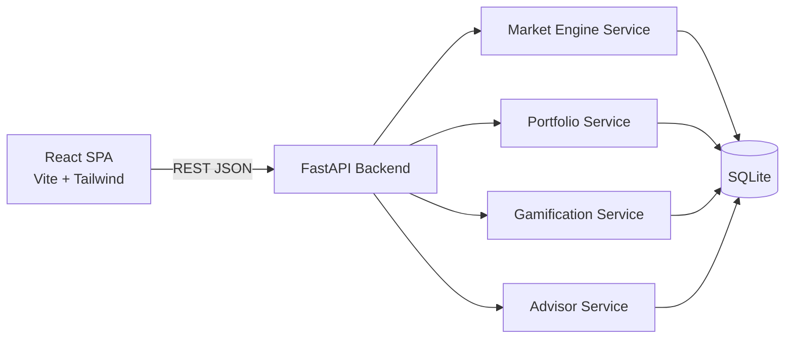

# Capital Market Simulator - Architecture

## 1. Product Overview

Capital Market Simulator is a single-player stock trading game. A player starts with
$100,000 in virtual cash and trades 50 fictional companies across five industries.
The market engine advances one trading day at a time, generating realistic prices,
economic regimes, and news events. The goal is to maximize portfolio value and total
return over a multi-year simulation.

Core loops:

- The player reviews market data and news, then buys and sells shares.
- Each "Advance Day" action runs the market engine: new prices, news, and cycle state.
- Portfolio value, P/L, achievements, and leaderboard rank update automatically.
- The AI advisor evaluates valuation, momentum, risk, and diversification.

## 2. System Architecture



### Backend layers

| Layer | Responsibility |
| --- | --- |
| `routers/` | HTTP endpoints, request validation, response shaping |
| `services/` | Pure business logic: market simulation, portfolio math, advisor rules, achievements |
| `database.py` | SQLAlchemy engine, session factory, connection lifecycle |
| `models.py` | ORM tables and relationships |
| `schemas.py` | Pydantic request/response contracts |
| `seed.py` | Deterministic seeding of companies, history, rivals, and game state |
| `main.py` | FastAPI app factory, CORS, static checks, route registration |

### Frontend layers

| Layer | Responsibility |
| --- | --- |
| `api/client.js` | Typed fetch wrapper with base URL and error handling |
| `store/` | React context for game state, portfolio, and market data |
| `hooks/` | Data hooks: polling, chart series, formatters |
| `components/charts/` | TradingView `lightweight-charts` wrappers |
| `components/*` | Feature views: dashboard, market, portfolio, advisor, achievements |

## 3. Data and Database Schema

The 50-company universe is seeded from a bundled snapshot
(`backend/app/data/a_share_snapshot.json`) of real China A-share daily prices
covering 2019-2026 (Tencent public quote API, for learning/simulation only).
Real company names, real prices, real volumes, and real CNY market caps are
kept un-scaled; the player starts with ¥100,000. The seeded history is real,
and future days replay the same real dataset (see below).

### Real-data replay

The snapshot covers 2019-2026. The game seeds its chart history from the first
504 rows, then each `advance` step reads the next real daily OHLC row for every
stock, so simulated future moves are actual A-share history. Technical metrics
(momentum, 52-week range, P/E, volume) are recomputed from the replayed close,
the order book is rebuilt around it, and news is generated from the real daily
gainers/losers. Market-cycle labels derive from real market breadth instead of a
Markov regime roll. The Shanghai Composite index series is bundled alongside the
stock data, replayed with the same cursor, exposed at `/api/index/history`, and
displayed in the top bar and dashboard.

SQLite via SQLAlchemy. All monetary values stored as REAL dollars, shares as REAL
(fractional shares are allowed), and dates as ISO trading days.

### `stocks`

| Column | Type | Notes |
| --- | --- | --- |
| id | INTEGER PK | |
| ticker | TEXT UNIQUE | Fictional symbol, e.g. `NEXA` |
| name | TEXT | Company name |
| industry | TEXT | technology, healthcare, energy, finance, consumer |
| price | REAL | Latest close |
| prev_close | REAL | Previous close |
| volatility | REAL | Daily sigma, 0.008 - 0.035 |
| market_cap | REAL | In dollars |
| pe_ratio | REAL | Updated on seed and by simulation drift |
| beta | REAL | Relative market sensitivity |
| fundamental_price | REAL | Slowly-moving anchor used for mean reversion |
| eps_estimate / eps_actual | REAL | Quarterly EPS estimate and last actual |
| earnings_growth | REAL | Annualized earnings growth rate |
| earnings_quality | REAL | Quality score driving surprise dispersion |
| style_growth | REAL | Growth-factor loading used for style rotation |
| last_surprise_pct | REAL | Last earnings surprise |
| next_earnings_day | INTEGER | Scheduled quarterly report day |
| volume | INTEGER | Latest daily volume |
| avg_volume | INTEGER | 30-day average volume |
| fifty_two_week_high | REAL | |
| fifty_two_week_low | REAL | |
| momentum_20d | REAL | 20-day return fraction |
| momentum_60d | REAL | 60-day return fraction |
| updated_at | TEXT | |

### `price_history`

| Column | Type | Notes |
| --- | --- | --- |
| id | INTEGER PK | |
| stock_id | INTEGER FK -> stocks.id | |
| trade_date | TEXT | ISO date |
| open / high / low / close | REAL | OHLC |
| volume | INTEGER | |

Unique index on `(stock_id, trade_date)`.

### `portfolio_history`

Daily equity snapshots captured at the end of every advance:

| Column | Type | Notes |
| --- | --- | --- |
| id | INTEGER PK | |
| player_id | INTEGER FK -> players.id | |
| day | INTEGER | Game day |
| date | TEXT | Simulated date |
| value / cash / invested | REAL | Equity breakdown |

Unique on `(player_id, day)`.

### `players`

| Column | Type | Notes |
| --- | --- | --- |
| id | INTEGER PK | |
| name | TEXT | Player name |
| starting_cash | REAL | Always 100,000 |
| cash | REAL | Cash available |
| created_at | TEXT | |

### `holdings`

| Column | Type | Notes |
| --- | --- | --- |
| id | INTEGER PK | |
| player_id | INTEGER FK | |
| stock_id | INTEGER FK | |
| shares | REAL | Fractional shares allowed |
| avg_cost | REAL | Weighted average cost |

Unique on `(player_id, stock_id)`.

### `transactions`

| Column | Type | Notes |
| --- | --- | --- |
| id | INTEGER PK | |
| player_id | INTEGER FK | |
| stock_id | INTEGER FK | |
| action | TEXT | buy / sell |
| shares | REAL | |
| price | REAL | Execution price |
| gross | REAL | shares * price |
| fee | REAL | Commission |
| net | REAL | Cash impact |
| realized_pnl | REAL | Sell P/L after fees |
| day | INTEGER | Game day number |
| executed_at | TEXT | |

### `news_events`

| Column | Type | Notes |
| --- | --- | --- |
| id | INTEGER PK | |
| day | INTEGER | Game day |
| headline | TEXT | |
| summary | TEXT | Educational explanation |
| category | TEXT | positive / negative / neutral |
| scope | TEXT | stock / industry / market |
| stock_id | INTEGER NULL | Target stock |
| industry | TEXT NULL | Target industry |
| impact_pct | REAL | Designed impact magnitude |
| created_at | TEXT | |

### `game_state`

Single row, id = 1:

| Column | Type | Notes |
| --- | --- | --- |
| day | INTEGER | Trading day index |
| date | TEXT | Simulated calendar date |
| market_cycle | TEXT | bull / bear / recession / recovery |
| sentiment | REAL | Market sentiment factor 0.6 - 1.4 |
| regime_strength | REAL | Momentum of current cycle |
| benchmark_value | REAL | Equal-weight index level |
| next_regime_day | INTEGER | When to re-roll regime |
| policy_rate | REAL | Central bank policy rate |
| inflation | REAL | Consumer price trend |
| style_factor | REAL | Growth vs. value style factor level |
| next_rate_day | INTEGER | Next policy review day |

### `achievements`

Catalog, id = 1..N:

| Column | Type | Notes |
| --- | --- | --- |
| id | INTEGER PK | |
| code | TEXT UNIQUE | e.g. `first_trade` |
| title | TEXT | |
| description | TEXT | |
| category | TEXT | trading / milestone / risk / strategy |

### `unlocked_achievements`

| Column | Type | Notes |
| --- | --- | --- |
| id | INTEGER PK | |
| player_id | INTEGER FK | |
| achievement_id | INTEGER FK | |
| unlocked_at | TEXT | |

Unique on `(player_id, achievement_id)`.

### `rivals`

Fictional leaderboard competitors with deterministic benchmark strategies:

| Column | Type | Notes |
| --- | --- | --- |
| id | INTEGER PK | |
| name | TEXT | |
| strategy | TEXT | e.g. value, momentum, index |
| cash | REAL | |
| invested_value | REAL | |
| total_value | REAL | |

Rivals hold fixed industry allocations; the market engine revalues them daily using
industry-level returns, so the leaderboard moves with the market.

### `earnings_reports`

Log of every quarterly report:

| Column | Type | Notes |
| --- | --- | --- |
| id | INTEGER PK | |
| stock_id | INTEGER FK -> stocks.id | |
| day | INTEGER | Game day |
| eps_estimate / eps_actual | REAL | Estimate vs. reported EPS |
| surprise_pct | REAL | Actual vs. estimate |
| reaction_pct | REAL | Same-day price reaction |

### `bot_holdings`

Positions held by simulated trading robots:

| Column | Type | Notes |
| --- | --- | --- |
| id | INTEGER PK | |
| bot_id | INTEGER FK -> rivals.id | |
| stock_id | INTEGER FK -> stocks.id | |
| shares / avg_cost | REAL | Position and average cost |

### `bot_trades`

Every robot execution, logged for the bots feed and flow analysis:

| Column | Type | Notes |
| --- | --- | --- |
| id | INTEGER PK | |
| bot_id / stock_id | INTEGER FK | |
| action | TEXT | buy / sell |
| shares / price / notional | REAL | Execution details |
| day | INTEGER | Game day |

### `bot_history`

Daily equity snapshots per robot, used for the manager archive charts:

| Column | Type | Notes |
| --- | --- | --- |
| id | INTEGER PK | |
| bot_id / day | FK / INTEGER | |
| value / cash / invested | REAL | Daily equity breakdown |

## 4. Market Simulation Model

Daily return per stock:

```
r_i = beta_i * R_market
    + sector_exposure_i * R_sector
    + momentum_pull
    + news_shock_i
    + sigma_i * epsilon
```

Components:

- `R_market`: market-wide factor driven by economic regime, sentiment, and a common
  random shock. Bull: +0.0005 baseline; Recovery: +0.0008; Bear: -0.0009;
  Recession: -0.0016.
- `R_sector`: industry factor with independent mean-reverting shock, amplified during
  sector-scoped news.
- Momentum pull: stocks with strong 20-day momentum get slight continuation, then
  mean reversion pulls extended moves back toward fair value.
- Fundamental anchor: each stock has a slowly drifting `fundamental_price`; daily
  returns include `-0.045 * ln(price / fundamental)`, which keeps multi-year prices
  in plausible ranges while still allowing real trends.
- Earnings anchor: `fundamental_price` is now derived from quarterly EPS estimates
  times a rate- and sentiment-driven industry multiple, so fundamentals lead price.
- Quarterly earnings: each company reports every 63 trading days on a staggered
  calendar. Surprise size depends on earnings quality, and the same-day reaction
  re-rates the stock and updates its growth estimate.
- Policy rate: inflation mean-reverts while the central bank reviews rates every
  15-30 days and steps toward a cycle- and inflation-driven target. Higher rates
  compress valuation multiples market-wide; cuts expand them.
- Industry correlation: daily industry shocks are drawn from a fixed 5x5
  correlation matrix (Cholesky factorized), so sectors move together realistically.
- Style factor: a mean-reverting growth/value factor tilts high-growth stocks
  during bull and recovery phases and favors value during stress.
- Realism calibration: idiosyncratic noise, market/sector shock sizes, news
  impact, and daily-return caps are tuned so the seeded universe averages about
  1.0-1.2% absolute daily moves with roughly 30% quiet days, close to real
  large-cap behavior. A light AR(1) term adds multi-day trend persistence.
- Simulated participants: eight trading robots hold real stock portfolios and
  rebalance each day toward strategy targets (momentum, value, index, sector
  rotation, low volatility, growth, dynamic cash cycling, quant). Their buy/sell
  orders are logged, add to daily volume, and create bounded order-flow price
  impact, so the leaderboard rivals are the same entities trading in the market.
- Order-book microstructure: each stock carries a top-of-book bid/ask and depth
  rebuilt around each day's close. Player and bot market orders fill against the
  book; orders within depth pay the spread, while oversized orders walk the
  price and consume depth. Liquidity is scaled by sentiment and cycle, and large
  fills in a thin book trigger a liquidity-factor shock that momentum-style bots
  react to by selling, producing stampede-like cascades.
- Return realism: regime re-rolls are scheduled so bull and bear phases are
  guaranteed to appear (forced bear/bull alternation), momentum is capped at a
  small daily pull, EPS growth feeds fundamentals at 60% of the headline rate,
  and the benchmark mean-reverts toward a 4%/year trend line. Bots pay
  transaction costs, and two retail-style bots churn with 0.5% costs and chase/
  cut behavior, so leaderboard returns spread from losers to winners instead of
  everyone profiting.
- A-share rules and retail ecology: daily price limits (10% main board, 20%
  ChiNext/STAR) clamp closes and zero out the blocked side of the book; T+1 locks
  same-day purchases with a `locked_shares` counter that unlocks on advance;
  sell orders pay 0.05% stamp duty. Eight retail-style bots add behavioral
  losses: all-in concentration, limit chasing, falling-knife catching, trend
  following, margin trading with forced liquidation below 75k, buy-and-hold
  sleeping, chase/cut, and panic selling. A cohort of 20 additional
  low-capital retail traders amplifies the losing side, and the leaderboard
  exposes win/flat/loss counts.
- Manager archives: `GET /api/bots/{id}` returns a manager's equity curve and
  trade log; the achievements page opens it in a modal so players can study how
  each strategy actually operates.
- News shock: generated events apply a designed shock to a stock, an industry, or the
  whole market, decaying over subsequent days.
- `epsilon`: standard normal idiosyncratic shock scaled by company volatility.

OHLC are synthesized around the close: `open = prev_close * (1 + small gap)`,
`high/low` envelope the open/close plus intraday range proportional to volatility.
Volume follows lognormal mean reversion with spikes on news days.

Regime transitions: every 20-40 trading days the engine re-rolls the market cycle
using a transition matrix. Recession is rarer, recovery follows recession, and
sentiment mean-reverts toward the regime's baseline.

## 5. Trading Rules

- Market orders only, executed at the current price.
- Fractional shares allowed; minimum notional $10 per order.
- Commission: `max(1.00, gross * 0.0015)`, charged on both sides.
- Buy requires sufficient cash after commission; sell requires held shares.
- Average-cost method for remaining holdings; realized P/L recorded per sell.
- Transaction history retains every execution.

## 6. AI Advisor

The advisor is a deterministic rule engine (no external model required) that scores
four dimensions and returns educational explanations:

| Dimension | Inputs | Output |
| --- | --- | --- |
| Valuation | P/E vs industry median, price vs 52w range | undervalued / fair / overvalued + score |
| Momentum | 20d/60d returns, distance from high | strong / neutral / weak |
| Risk | volatility, beta, max drawdown | low / medium / high |
| Diversification | sector weights, Herfindahl index, cash weight | concentrated / balanced |

`/api/advisor/portfolio` returns a portfolio report plus per-holding cards.
`/api/advisor/chat` answers free-text questions with context-aware, educational
responses using keyword routing (valuation, momentum, risk, diversification, buy,
sell, cash, sector).

## 7. Gamification

- 16 achievements across trading, milestones, risk, and strategy categories
  (first trade, first sell, five sectors, 20% return, bear-market survivor,
  concentrated-risk warning, 100 trades, etc.).
- Investment milestones unlock at portfolio-value thresholds and are shown as a
  progress rail on the achievements page.
- Leaderboard ranks the player against 8 fictional rivals and an equal-weight
  benchmark; rank percentile updates each day.

## 8. UI Design

### Design language

Professional trading terminal: dark neutral canvas, dense data, restrained accents.

- Background: `#0a0f14`; panels `#10171f`; borders `#1d2833`
- Positive: emerald `#22c55e`; negative: red `#ef4444`
- Accents: amber for cycle badges, sky for info, violet only for advisor identity
- Type: Inter; tabular figures for numbers; zero letter spacing
- Cards are 8px radius; pages are full-width bands, not nested card stacks

### Layout

- Slim left sidebar: Dashboard, Market, Portfolio, Advisor, Achievements
- Top bar: game date, market cycle, market sentiment, benchmark, Advance Day button,
  reset button
- Main content: responsive grid that becomes single-column on mobile

### Pages

| Page | Content |
| --- | --- |
| Dashboard | Portfolio value, cash, daily P/L, total return; equity curve; sector allocation donut; top movers; recent trades; market snapshot |
| Market | Filterable/sortable 50-stock table; candlestick + volume chart; stock detail panel; daily news feed with impact scope |
| Portfolio | Holdings table with cost basis and P/L; allocation by sector; performance chart; transaction history |
| Advisor | Portfolio health score; per-holding analysis; diversification report; educational chat |
| Achievements | Unlocked/locked grid; milestone rail; leaderboard table |

### Key interactions

- Buy/Sell opens a compact order form in the stock detail panel.
- Clicking a row selects that stock and loads its 1-year history.
- "Advance Day" runs the simulation; the UI polls the backend afterward.
- Reset restarts the game from day 0 with a fresh $100,000.

## 9. API Contract

| Method | Path | Purpose |
| --- | --- | --- |
| GET | `/api/state` | Game state, player cash, portfolio value, P/L |
| POST | `/api/game/advance` | Run one trading day |
| POST | `/api/game/reset` | Reset player and market to day 0 |
| GET | `/api/stocks` | Stock list with quote data |
| GET | `/api/stocks/{ticker}/history` | OHLC series |
| GET | `/api/earnings` | Recent quarterly earnings reports |
| GET | `/api/bots` | Trading bots, recent executions, and net flows |
| POST | `/api/trades` | Execute buy/sell |
| GET | `/api/transactions` | Trade history |
| GET | `/api/portfolio` | Holdings, allocation, performance |
| GET | `/api/news?limit=` | News feed |
| GET | `/api/advisor/portfolio` | Advisor report |
| POST | `/api/advisor/chat` | Advisor chat |
| GET | `/api/achievements` | Catalog + unlock state |
| GET | `/api/leaderboard` | Player vs rivals vs benchmark |

## 10. Testing and Deployment

- Backend: pytest against a temporary SQLite database, covering market advance,
  trade validation, portfolio math, advisor scoring, achievements, leaderboard.
- i18n: backend content (news, advisor, achievements, company and rival names)
  is localized at response time via the `Accept-Language` header; the React app
  holds an `en`/`zh` dictionary and refetches data when the language changes.
- Frontend: production build via Vite; Playwright screenshot verification across
  desktop and mobile viewports.
- Local run: `uvicorn app.main:app` on port 8000, Vite dev server on port 5173 with
  a proxy to the backend.
